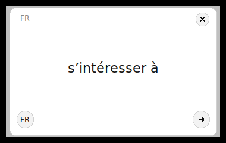

# Voci – Vokabel-Karte, immer im Vordergrund

Kleines Flashcard-Fenster (wie der Taschenrechner im „Immer im Vordergrund"-Modus),
das die Französisch-Vokabeln aus *Reprise étape 1* abfragt (243 Wortpaare).
Läuft unter Windows, macOS und Linux.

### ➜ [**Hier herunterladen**](https://github.com/janiki33/voci/releases/latest)



## Herunterladen

Auf der [Download-Seite](https://github.com/janiki33/voci/releases/latest)
liegen die fertigen Dateien:

| Datei | Für wen |
|---|---|
| **`Voci-Setup.exe`** | **Für Windows die empfohlene Fassung.** Installiert Voci an einen festen Ort, Zielordner frei wählbar, Desktop-Verknüpfung zum Ankreuzen, **keine Adminrechte nötig**. Damit funktionieren auch die Updates zuverlässig. |
| `Voci-Windows-Ordner.zip` | Ohne Installation: entpacken, `Voci.exe` im Ordner starten. |
| `Voci.exe` | Windows als eine einzige Datei – bequemer, wird aber von Virenscannern gerne fälschlich gemeldet. |
| `Voci-macOS.zip` | macOS mit Apple Silicon (M1–M4). Entpacken, `Voci.app` starten. |
| `Voci.pyw` | Alle Systeme mit installiertem Python – die einzige Variante ganz ohne Warnung. Braucht einmalig `pip install PySide6`. |

Auf **Intel-Macs** läuft die `Voci-macOS.zip` nicht; dort nimmst du die `Voci.pyw`,
installierst einmalig `pip3 install PySide6` und startest mit `python3 Voci.pyw`.

Alles wird bei jeder Änderung automatisch von GitHub Actions neu gebaut
(siehe `.github/workflows/build.yml`).

### Windows warnt beim ersten Start

Beim Start der EXE kommt **„Der Computer wurde durch Windows geschützt"**. Das ist
keine Virenmeldung — Windows warnt bei jedem Programm ohne gekauftes
Signaturzertifikat. Unter *Weitere Informationen* steht deshalb **„Unbekannter
Herausgeber"**: Diese Zeile speist sich ausschliesslich aus der digitalen
Signatur, nicht aus den Dateiangaben. Ohne Zertifikat lässt sie sich nicht
ändern. Wer der Urheber ist, steht aber in den Dateieigenschaften — Rechtsklick
auf `Voci.exe` → *Eigenschaften* → *Details*: **Janosch Salzgeber**.

Zwei Wege an der Warnung vorbei:

- Im Warnfenster auf **Weitere Informationen** → **Trotzdem ausführen**.
- Oder vorher: Rechtsklick auf die heruntergeladene `Voci.exe` → **Eigenschaften**
  → unten bei *Sicherheit* den Haken bei **Zulassen** setzen → **OK**.

### macOS warnt beim ersten Start

**„Voci" kann nicht geöffnet werden, da Apple es nicht auf Schadsoftware
überprüfen kann.** Auch das ist keine Virenmeldung, sondern die fehlende
Apple-Signatur (99 USD pro Jahr für ein Entwicklerkonto).

- **macOS 15 (Sequoia) und neuer:** Doppelklick, Meldung wegklicken, dann
  **Systemeinstellungen → Datenschutz & Sicherheit** öffnen, ganz nach unten
  scrollen und dort **Dennoch öffnen** wählen (mit Touch ID oder Passwort
  bestätigen).
- **macOS 14 und älter:** Rechtsklick (oder Ctrl-Klick) auf `Voci.app` →
  **Öffnen** → im Dialog nochmals **Öffnen**.
- **Per Terminal:** `xattr -dr com.apple.quarantine /Pfad/zu/Voci.app`

Beides ist einmal pro heruntergeladener Datei nötig. Ganz wegbekommen liesse sich
die Warnung nur über den jeweiligen App-Store: Laut
[Microsofts Vergleich der Signatur-Optionen](https://learn.microsoft.com/en-us/windows/apps/package-and-deploy/code-signing-options)
bauen selbst gekaufte OV- und EV-Zertifikate ihre Reputation erst über Zeit auf —
seit 2024 umgeht auch EV die SmartScreen-Warnung nicht mehr sofort.

### Virenscanner-Fehlalarme

Etwas anderes als die Warnungen oben: Manche Scanner melden bei selbstgebauten
Programmen eine Bedrohung, obwohl keine da ist — bei Defender typischerweise als
`Trojan:Win32/Sabsik.FLA!ml`. Das `!ml` steht für „machine learning", also eine
Verdachtseinstufung ohne konkrete Signatur.

Die Windows-Fassung wird deshalb mit **Nuitka** gebaut, nicht mit PyInstaller.
PyInstaller hängt die Anwendung an einen vorkompilierten Bootloader, der in jeder
damit gebauten EXE weltweit identisch ist — auch in Schadsoftware, die damit
gebaut wurde. Genau darauf schlagen die Heuristiken an. Nuitka übersetzt den
Python-Code stattdessen nach C und kompiliert ein gewöhnliches Programm, dem
dieser gemeinsame Nenner fehlt. Dazu kommen eigenes Icon, vollständige
Versionsinformationen und keine UPX-Komprimierung.

Falls ein Scanner trotzdem anschlägt:

1. Nimm die **Ordner-Variante** (`Voci-Windows-Ordner.zip`) — die entpackt sich
   beim Start nicht selbst und ist genau dafür da. Die Einzeldatei `Voci.exe`
   lässt sich dagegen nicht zuverlässig fehlalarmfrei bauen: Dass ein Programm
   sich beim Start selbst entpackt, ist nun einmal auch ein Malware-Verhalten,
   und ohne Signatur fehlt der Gegenbeweis.
2. Oder melde den Fehlalarm dem Hersteller. Für Microsoft Defender geht das hier:
   [Datei zur Analyse einreichen](https://www.microsoft.com/en-us/wdsi/filesubmission).
   Solche Meldungen werden meist innert weniger Tage korrigiert und gelten dann
   für alle.
3. Ganz ohne EXE: die `Voci.pyw` mit installiertem Python starten.

## Bedienung

| Aktion | Wirkung |
|---|---|
| Klick auf die Karte | flippt FR ↔ DE (in beide Richtungen, beliebig oft) |
| Kreis oben links (FR/DE) | Startsprache umschalten |
| Kreis oben rechts (×) | beenden |
| Kreis unten links (←) | ein Wort zurück (max. 10) |
| Kreis unten rechts (→) | nächstes Wort |
| Karte ziehen | Fenster verschieben |
| Rand/Ecke ziehen | Fenster grösser/kleiner ziehen |
| Taste **d** | Dark Mode an/aus |
| Taste **u** | gefundenes Update einspielen |
| Taste **m** | Menü öffnen/schliessen (Einstellungen, Voci-Sets) |
| Taste **c** / **v** / **b** | Wort bewerten: kann ich nicht / neutral / kann ich schon |
| Pfeil **←** / **→** | zurück / weiter |

Der Schalter **Pfeil-Knöpfe auf der Karte** blendet die Knöpfe ← → aus (X und
FR/DE bleiben). Die **Pfeiltasten der Tastatur wirken immer**, auch bei
ausgeblendeten Knöpfen und auch dann, wenn gerade das Menü oder die
Wörterliste vorne ist.

Der **Zurück-Knopf springt ein Wort zurück** – Flips und der Sprachumschalter
zählen nicht als Schritt. Das vorherige Wort erscheint in der Sprache, die
gerade angezeigt wird: Ist man gerade auf DE, kommt es auf DE, egal wie man es
verlassen hat. Maximal 10 Wörter; ohne Historie ist der Knopf ausgeblendet.

### Animationen

Jede Aktion hat ihre eigene Bewegung:

- **Flip:** Die Karte dreht sich perspektivisch um die Hochachse; auf halbem
  Weg wechselt das Wort. Die zweite Hälfte dreht von −90° zurück, sonst stünde
  die Schrift spiegelverkehrt.
- **Wortwechsel:** Das alte Wort zieht zur Seite ab und das neue kommt von der
  anderen Seite herein — Richtung passend zu vor oder zurück. Der Rahmen mit
  den Knöpfen bleibt dabei ruhig stehen, der Text wird am Kartenrand
  beschnitten.
- **Wertung (c/v/b):** Die Farbe schwillt an und klingt wieder ab, die Karte
  poppt kurz auf, dann gleitet das nächste Wort herein.
- **Knöpfe:** Der graue Kreis wächst beim Draufzeigen weich ein statt hart
  umzuspringen; der Schliessknopf wandert dabei ins macOS-Rot.
- **Schalter:** Der Knauf gleitet und wird beim Klick kurz breiter, die Farbe
  wandert von Grau nach Grün.
- **Segmentregler:** Der helle Reiter gleitet zum neuen Segment.
- **Fenster:** Karte, Menü und Wörterliste blenden beim Öffnen ein und fahren
  leicht heran.

Alle Bewegungen lassen sich im Menü über *Flip-Animation* abschalten.

Das Fenster ist **immer im Vordergrund**, hat keinen Titel, kein Minimieren und
kein Maximieren, weisse Karte mit schwarzem Text in Graustufen, abgerundete Ecken
und randlose Knöpfe, die nur beim Draufzeigen grau werden.

**Dark Mode:** Taste **d** schaltet auf komplett schwarze Karte mit weissem Text
um und wieder zurück – ohne Schaltfläche. Damit die Taste ankommt, muss das
Fenster den Fokus haben; ein Klick darauf genügt.

**Auto-Weiter:** Tabbt man aus dem Fenster raus, nachdem das aktuelle Wort schon
einmal geflippt wurde, kommt nach 5 Sekunden automatisch das nächste Wort
(ein feiner Balken unten zählt runter) – ausser man tabbt vorher wieder rein.

## Lern-Algorithmus

Jede Vokabel trägt einen **Faktor**, der bei 1 startet und ihre
Ziehungswahrscheinlichkeit gewichtet:

- **c** („kann ich noch nicht") erhöht den Faktor um **+0.1** → das Wort kommt öfter
- **v** (neutral) lässt ihn stehen
- **b** („kann ich schon") senkt ihn um **−0.2** → das Wort kommt seltener

Bei **Faktor 0 kommt das Wort gar nicht mehr**. Nach einer Bewertung leuchtet
die Karte kurz auf — rot (c), gelb (v), grün (b) — und springt automatisch zum
nächsten Wort. Geht man zurück (bis zu 10 Wörter) und bewertet neu, **ersetzt**
die neue Wertung die alte, statt sich zu ihr zu addieren. Die Faktoren werden
dauerhaft im Benutzerordner gespeichert.

Die **Wertung** in der Wörterliste rechnet den Faktor um: 1 (und alles darüber)
= 0 %, 0.5 = 50 %, 0 = 100 % — mit Farbpunkt von Rot über Gelb nach Grün.

## Menü (Taste m)

- **Einstellungen:** Dark Mode, immer im Vordergrund, Pfeil-Knöpfe auf der
  Karte, Flip-Animation, Auto-Weiter an/aus und dessen Dauer (3/5/10 s),
  Startsprache.
  Alles wird gespeichert und beim nächsten Start wiederhergestellt.
- **Voci-Sets:** Wortsets an- und abwählen (mehrere möglich; aktuell gibt es
  *Étape 1*). Hinter **⋯** liegen *Schwere Wörter üben* (nur Wörter mit
  Faktor ≥ 1) und *Wörterliste anzeigen*: sortierbar nach A–Z oder Wertung,
  mit Farbpunkt und Prozent pro Wort, ↺ setzt ein einzelnes Wort zurück,
  *Alle zurücksetzen* alles.

## Installation unter Windows

`Voci-Setup.exe` installiert nach `%LOCALAPPDATA%\Programs\Voci` — im
Benutzerbereich, deshalb ohne Adminrechte und ohne UAC-Abfrage. Im Setup
lassen sich wählen:

- **Zielordner** (frei änderbar; wer für alle Benutzer installieren will,
  kann im Setup auf Adminrechte umschalten und landet in *Programme*)
- **Desktop-Verknüpfung** (Kästchen)
- **Startmenü-Eintrag** (Kästchen)
- **Automatisch starten beim Anmelden** (Kästchen, standardmässig aus)

Deinstalliert wird regulär über *Apps & Features*.

Der Hauptgrund für das Setup ist der Updater: Wenn Voci an einem festen Ort
liegt, weiss er genau, wo er die Dateien austauschen muss. Bei einer irgendwo
entpackten ZIP hängt das davon ab, wohin sie entpackt wurde.

## Updates

Das Programm hält sich selbst aktuell, in zwei getrennten Teilen.

**Wortliste.** Bei jedem Start lädt Voci im Hintergrund `vokabeln.json` aus
diesem Repo und legt sie im Benutzerordner ab (`%APPDATA%\Voci` unter Windows,
`~/Library/Application Support/Voci` unter macOS, `~/.config/Voci` unter Linux).
Ab dem nächsten Start gilt die neue Liste. Neue Vokabeln brauchen also keinen
neuen Download — nur einen Push auf `main`. Eine unvollständige oder kaputte
Datei wird verworfen; dann bleibt die eingebaute Liste in Betrieb.

**Programm.** Ebenfalls beim Start prüft Voci, ob es eine neuere Fassung gibt.
Falls ja, erscheint unten auf der Karte dezent *„Update verfügbar · Taste u"*.
Ein Druck auf **u** lädt die passende Datei, tauscht sie aus und startet das
Programm neu.

Ein paar Entscheidungen dahinter:

- Die Versionsabfrage nutzt die Weiterleitung von `/releases/latest` statt der
  GitHub-API. Das ist eine gewöhnliche Webanfrage und läuft damit nicht in das
  API-Limit von 60 Abfragen pro Stunde und IP-Adresse — in einem Schulnetz
  hinter einer gemeinsamen Adresse wäre das sonst schnell erreicht.
- Ein laufendes Programm kann sich unter Windows nicht selbst überschreiben.
  Deshalb schreibt Voci ein kleines Hilfsskript, das wartet, bis das Programm
  beendet ist, dann tauscht und neu startet.
- Getauscht wird erst, wenn die neue Fassung vollständig heruntergeladen und
  entpackt ist. Die alte wird beiseitegelegt und erst gelöscht, wenn die neue
  steht; scheitert der Tausch, kommt die alte zurück.
- Alle Netzzugriffe laufen in Hintergrundfäden mit kurzem Zeitlimit und werden
  bei Fehlern still verworfen. Ohne Internet startet und läuft Voci normal.

Welche Datei geholt wird, hängt davon ab, wie Voci installiert ist: die
Ordnerfassung ersetzt ihren Ordner, die Einzeldatei sich selbst, das
macOS-Bundle sich selbst.

## Vokabeln ändern

Die Wortpaare liegen in `vokabeln.json` (`fr` / `de`). Nach einer Änderung die App
neu bauen – das bettet die Vokabeln in `Voci.pyw` ein, damit die Datei alleine
lauffähig ist:

```
python build/make_app.py
```

Beim Push auf `main` baut GitHub Actions daraus automatisch eine neue `Voci.exe`.
Für neue Vokabeln genügt aber schon die Änderung an `vokabeln.json` — laufende
Installationen holen sie sich beim nächsten Start von selbst.

Quelle der Vokabeln: `Voca_étape_R1_BMV_B_2025` (Word-Dokument, Tabelle FR|DE).

## Technik

Die Oberfläche ist mit **Qt (PySide6)** gebaut. Damit zeichnet das Programm
mit echtem Per-Pixel-Alpha: weiche Schatten und runde Ecken auf allen
Plattformen, kantengeglättete Knöpfe, Kippschalter und Segmentregler im
Apple-Stil, und die Flip-Animation läuft über Qt-Animationskurven. Die
gesamte Logik (Lern-Algorithmus, Updater, Speicherung) ist davon getrennt
und reines Python ohne UI-Abhängigkeit.

## Icon

Das App-Icon (Trikolore) wird aus `build/make_icons.py` erzeugt und liegt als
`assets/voci.png`, `assets/voci.ico` (Windows) und `assets/voci.icns` (macOS) im
Repo. Nach einer Änderung neu erzeugen mit `python build/make_icons.py`.
